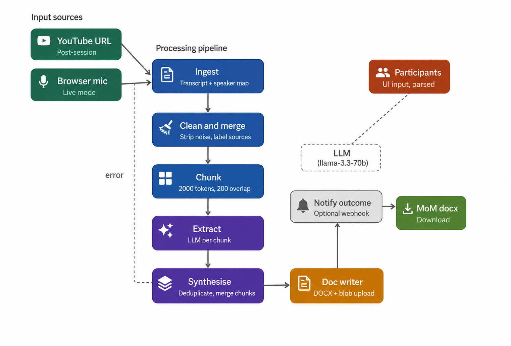

# TA Buddy — MoM Agent

**Automated Meeting Minutes for Microsoft Innovation Hub engagements.**

The MoM Agent takes a recording URL or live microphone audio, runs it through a LangGraph pipeline, and produces a structured Word document — agenda items, action items, decisions, and key insights — ready to download and for handoff to the Outcome Agent.

---

## Features

- **Post-session mode** — paste a YouTube or Teams recording URL; the agent fetches the auto-transcript via yt-dlp and falls back to Groq Whisper if captions are unavailable
- **Live mode** — capture audio directly in the browser in 30-second chunks; pipeline triggers when you stop recording
- **Participant parsing** — paste any attendee list format; the LLM parses names, designations, and roles (MIH/TA, Microsoft, Client)
- **Multi-chunk extraction** — transcript is chunked at 2000 tokens with 200-token overlap so action items straddling chunk boundaries are never missed
- **Synthesis and deduplication** — a second LLM pass merges all chunk extractions, deduplicates action items and decisions, and writes final agenda discussions
- **DOCX output** — formatted Word document with meeting info, agenda sections, decisions, action item table, and open questions
- **Real-time progress** — Server-Sent Events stream each pipeline step to the browser as it runs
- **Azure Blob Storage** — generated documents are uploaded to blob and can be downloaded through the API
- **Engagement-type aware** — flexible tags adapt to BEW, ADS, RPD, or SEW session types (ROI signals, technical requirements, prototype scope items, etc.)

---

## Architecture

> Add `pipeline_diagram.png` and `architecture_diagram.png` to the repo root (screenshots of the diagrams in this README).




```
Browser (index.html)
       |
       | HTTP / SSE
       v
FastAPI server (api.py)
       |
       | background threads
       v
LangGraph pipeline
  ingest_node
       |  (conditional: error -> END)
  clean_merge_node
       |
  chunk_node
       |
  extract_node          <-- Groq LLM per chunk
       |
  synthesise_node       <-- Groq LLM (single consolidation call)
       |
  doc_writer_node       <-- python-docx -> Azure Blob / local
       |
  notify_outcome_node   <-- optional webhook to Outcome Agent
       |
      END
```

Each node reads from and writes to `MoMState`, a TypedDict that flows through the entire graph. Any node can set `state["error"]` to short-circuit to END.

---

## Repo Structure

```
mom_agent/
  api.py              FastAPI server, endpoints, SSE event loop, session store
  graph.py            LangGraph graph definition and builder
  state.py            MoMState TypedDict, InputMode and Speaker enums
  ingest.py           Transcript ingestion (yt-dlp VTT, Whisper fallback, live chunks)
  clean_merge.py      Artefact stripping, source labelling, speaker map derivation
  chunk.py            tiktoken-based chunking (2000 tokens, 200 overlap)
  extract.py          Per-chunk Groq LLM extraction to structured JSON
  synthesise.py       Cross-chunk consolidation and deduplication via Groq
  doc_writer.py       python-docx document builder, blob upload
  blob.py             Azure Blob Storage helpers with local fallback
  transcription.py    Transcription abstraction (Groq Whisper / Azure Speech)
  prompts/
    extraction.py     System prompt and user prompt template for extract_node
frontend/
  index.html          Single-page UI (vanilla JS, no build step)
```

---

## Quickstart

### 1. Install dependencies

```bash
pip install fastapi uvicorn langgraph groq tiktoken yt-dlp python-docx \
            azure-storage-blob httpx python-dotenv
```

### 2. Configure environment

Create a `.env` file in the project root:

```env
# Required
GROQ_API_KEY_1=gsk_...

# Optional
GROQ_MODEL=llama-3.3-70b-versatile
AZURE_STORAGE_CONNECTION_STRING=DefaultEndpointsProtocol=https;...
AZURE_BLOB_CONTAINER=ta-buddy-shared
TRANSCRIPTION_BACKEND=groq
OUTCOME_AGENT_URL=http://localhost:8002
```

### 3. Run the server

```bash
uvicorn mom_agent.api:app --reload --port 8001
```

Open `http://localhost:8001` in your browser.

---

## Usage

### Post-session (YouTube / Teams URL)

1. Enter company name and engagement type
2. Select **Post-Session** and paste the recording URL
3. Click **Continue** and paste or manually add attendees
4. Click **Generate Minutes** and watch the pipeline run in real time
5. Download the `.docx` when complete

### Live recording

1. Select **Live Recording** on the mode screen
2. Add participants, then click **Generate Minutes**
3. Allow microphone access when prompted
4. Click **Stop and Generate Minutes** when the meeting ends

### Participant parsing

Paste any format into the attendee text area:

```
Microsoft Innovation Hub
- Arvind Raman, Principal Tech Strategist

ICICI Lombard
- Vikram Nair, CDO
- Priya Shah, VP Engineering
```

The LLM extracts names, designations, and infers roles automatically.

---

## API Reference

| Method | Endpoint | Description |
|--------|----------|-------------|
| `POST` | `/run` | Start post-session pipeline |
| `POST` | `/audio-chunk?session_id=...` | Upload a 30s audio blob (live mode) |
| `POST` | `/run-live` | Trigger pipeline after live recording |
| `GET` | `/status/{session_id}` | SSE stream of pipeline progress |
| `GET` | `/download/{session_id}` | Download generated DOCX |
| `POST` | `/parse-participants` | Parse free-text attendee list |
| `GET` | `/companies` | List all companies in blob store |
| `GET` | `/sessions/{company}` | List sessions for a company |

---

## Output Document Structure

The generated DOCX contains:

- **Cover page** — meeting title, date, session ID, facilitator, attendees by role with designations
- **Agenda sections** — one per problem statement, each with Discussions, Decisions, Action Items, Open Questions, and Key Insights subsections
- **Action Items Summary** — consolidated table with owner, designation, and deadline

---
